### EX -02 OUTLIER

# AIM
You are given bhp.csv which contains property prices in the city of banglore, India. You need to examine price_per_sqft column and do following,

(1) Remove outliers using IQR 

(2) After removing outliers in step 1, you get a new dataframe.

(3) use zscore of 3 to remove outliers. This is quite similar to IQR and you will get exact same result

(4) for the data set height_weight.csv find the following

    (i) Using IQR detect weight outliers and print them

    (ii) Using IQR, detect height outliers and print them
 
# EXPLANATION
   
 An Outlier is an observation in a given dataset that lies far from the rest of the observations. That means an outlier is vastly larger or smaller than the remaining values in the set. An outlier is an observation of a data point that lies an abnormal distance from other values in a given population. (odd man out).Outliers badly affect mean and standard deviation of the dataset. These may statistically give erroneous results.Most machine learning algorithms do not work well in the presence of outlier. So it is desirable to detect and remove outliers.Outliers are highly useful in anomaly detection like fraud detection where the fraud transactions are very different from normal transactions.  

# ALGORITHM

### STEP 1
Read the given Data.

### STEP 2
Get the information about the data.

### STEP 3
Detect the Outliers using IQR method and Z score.

### STEP 4
Remove the outliers.

### STEP 5
Plot the datas using Box Plot.

# PROGRAM

```
Developed by : M Vignesh
Registration Number : 212220233002
```
```
import pandas as ps
import numpy as np
import seaborn as sns

df=ps.read_csv("bhp.csv")
df

df.head()
df.describe()
df.info()
df.isnull().sum()
df.shape

sns.boxplot(x="price_per_sqft",data=df)

q1=df['price_per_sqft'].quantile(0.35)
q3=df['price_per_sqft'].quantile(0.65)
print("First Quantile =",q1,"Second quantile =",q3)

IQR=q3-q1 #INTERQUARTILE RANGE
ul =q3+0.5*IQR
ll =q1-1.5*IQR

df1=df[((df['price_per_sqft']<=l1)&(df['price_per_sqft']>u1))]
df1

df1.shape

sns.boxplot(x='price_per_sqft',data=df1)

from scipy import stats
z=np.abs(stats.zscore(df['price_per_sqft']))
df2=df[(z<3)]
df2

print(df2.shape)

sns.boxplot(x='price_per_sqft',data=df2)

df3=ps.read_csv('height_weight.csv')
df3

df3.head()
df3.info()
df3.describe()
df3.isnull().sum()
df3.shape

sns.boxplot(x='weight',data=df3)

q1=df3['weight'].quantile(0.25)
q3=df3['weight'].quantile(0.75)
print('First Quantile =',q1,'Second Quantile =',q3)

IQR=q3-q1
u1=q3+1.5*IQR
l1=q1-1.5*IQR

df4 =df3[((df3['height']>=l1)&(df3['height']<=u1))]
df4

df4.shape

sns.boxplot(x='height',data=df4)
```

# OUTPUT

### DATASET FOR BHP_CSV
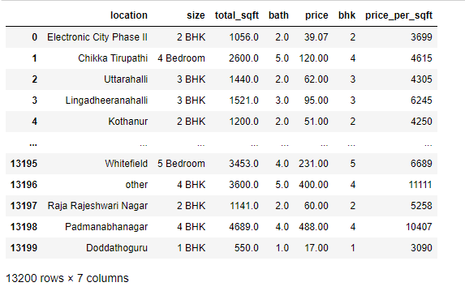
### DATASET HEAD(BHP)

### DATASET DESCRIBE(BHP)
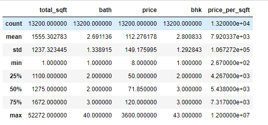
### DATASET INFO(BHP)
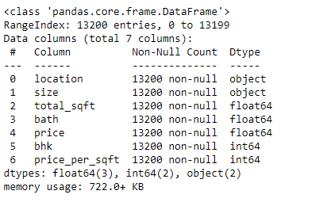
### DATASET NULL VALUES(BHP)
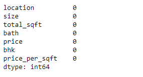
### DATASET SHAPE WITH OUTLIERS(BHP)
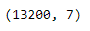
### DATASET BOXPLOT WITH OUTLIERS(BHP)

### DATASET WITHOUT OUTLIERS(BHP)
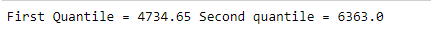
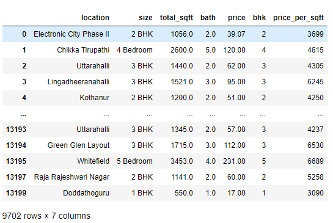
### DATASET SHAPE WITHOUT OUTLIERS(BHP)
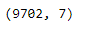
### DATASET BOXPLOT WITHOUT OUTLIERS(BHP)
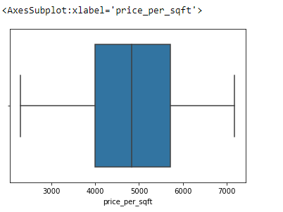
### DATASET AFTER REMOVAL OF OUTLIERS USING Z-SCORE(BHP)
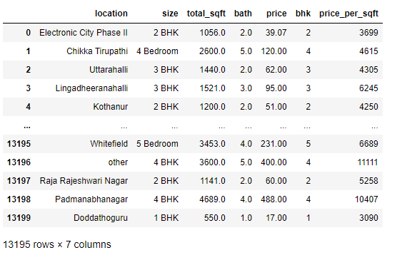
### DATASET SHAPE AFTER REMOVAL OF OUTLIERS USING Z-SCORE(BHP)
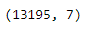
### DATASET BOXPLOT AFTER REMOVAL OF OUTLIERS USING Z-SCORE(BHP)
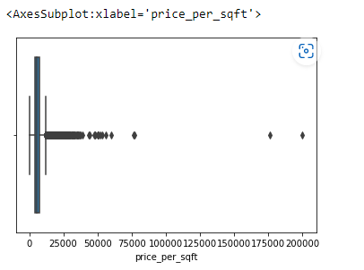
### DATASET FOR WEIGHT_HEIGHT_CSV
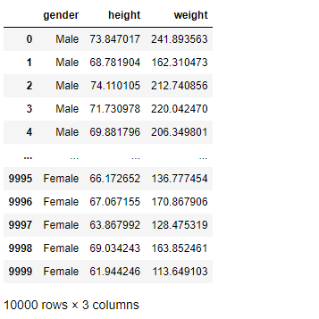
### DATASET HEAD(WEIGHT_HEIGHT)
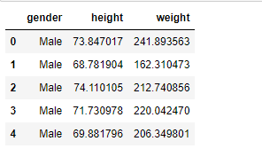
### DATASET INFO(WEIGHT_HEIGHT)
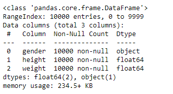
### DATASET DESCRIBE(WEIGHT_HEIGHT)
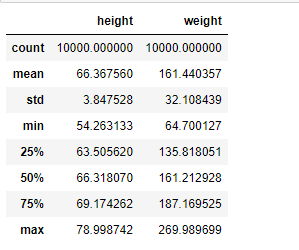
### DATASET NULL VALUES(WEIGHT_HEIGHT)
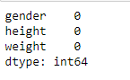
### DATASET BOXPLOT WITH OUTLIERS(WEIGHT_HEIGHT)
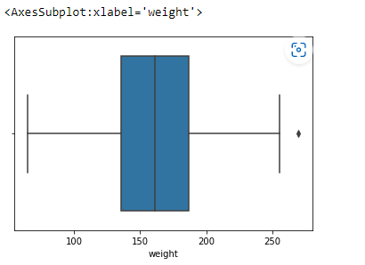
### DATASET AFTER REMOVING OUTLIERS USING IQR METHOD(WEIGHT_HEIGHT)
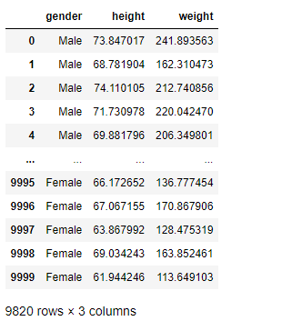
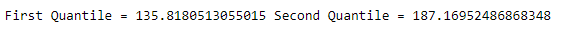
### DATASET SHAPE(WEIGHT_HEIGHT)
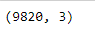
### DATASET BOXPLOT AFTER REMOVING OUTLIERS USING IQR METHOD(WEIGHT_HEIGHT)
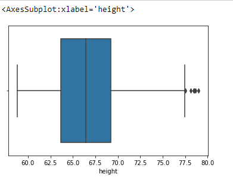

# RESULT
The given datasets are read and outliers are detected and are removed using IQR and z-score methods.
